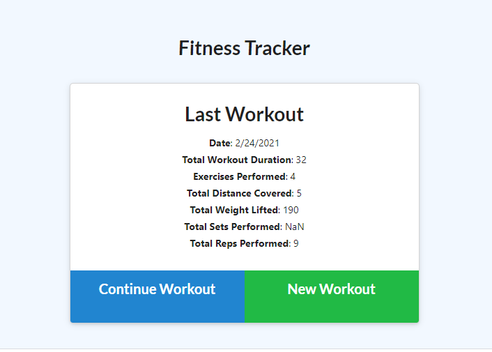
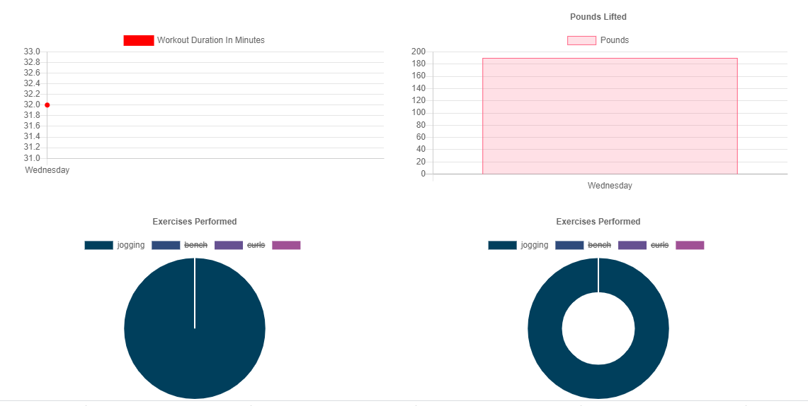

# workout-tracker

## Description
This workout tracker application keeps track of the user's workout using MongoDB. The user can create a new workout so that they can add cardio and resistance exercises to it with the relevant data. The user can navigate to '/stats' page to visualize their workouts in chart form.

I was provided with the front-end code. I created the schema via Mongoose and handle routes with Express. 

**Note** There are a few bugs on this currently with the data not displaying correctly.

## Repository / Deployment

Repository is [here](https://www.github.com/awpdev/workout-tracker).

[Here](https://glacial-cliffs-08565.herokuapp.com/) is a link to the deployed site.

## Visuals
[Here](https://youtu.be/rtNc4QjvBVM) is a link to a video demonstrating the functionality of the app.

